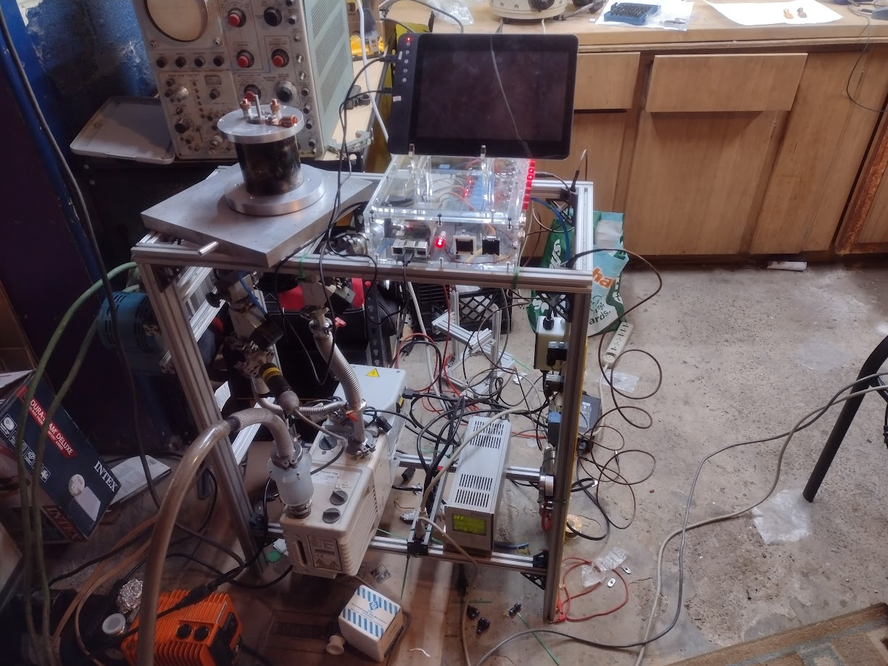
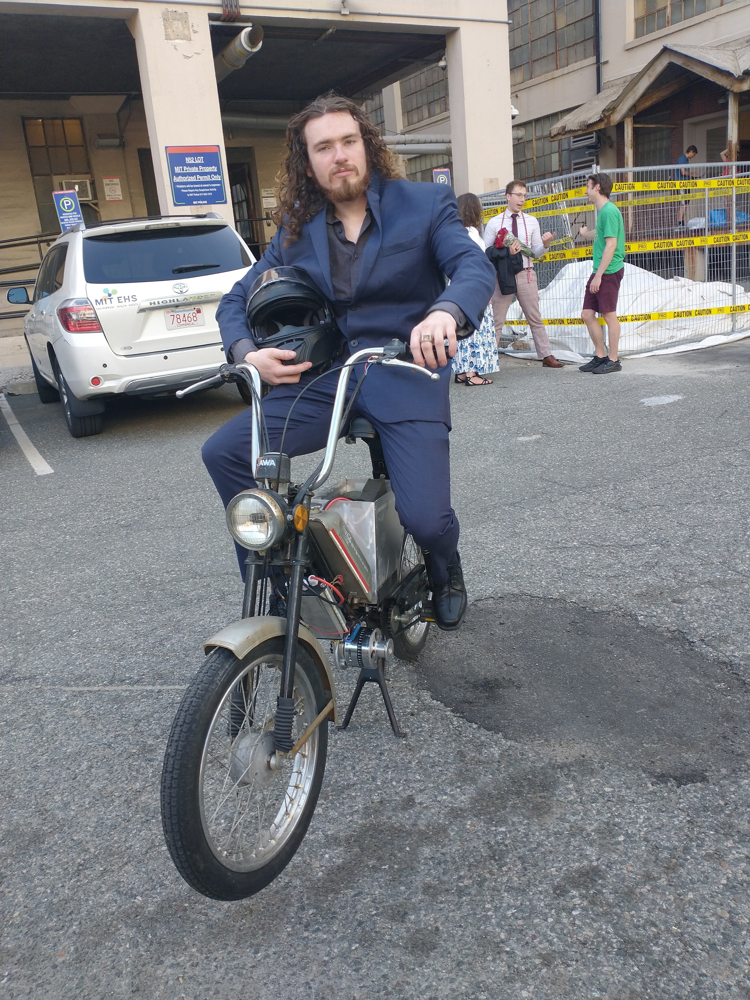
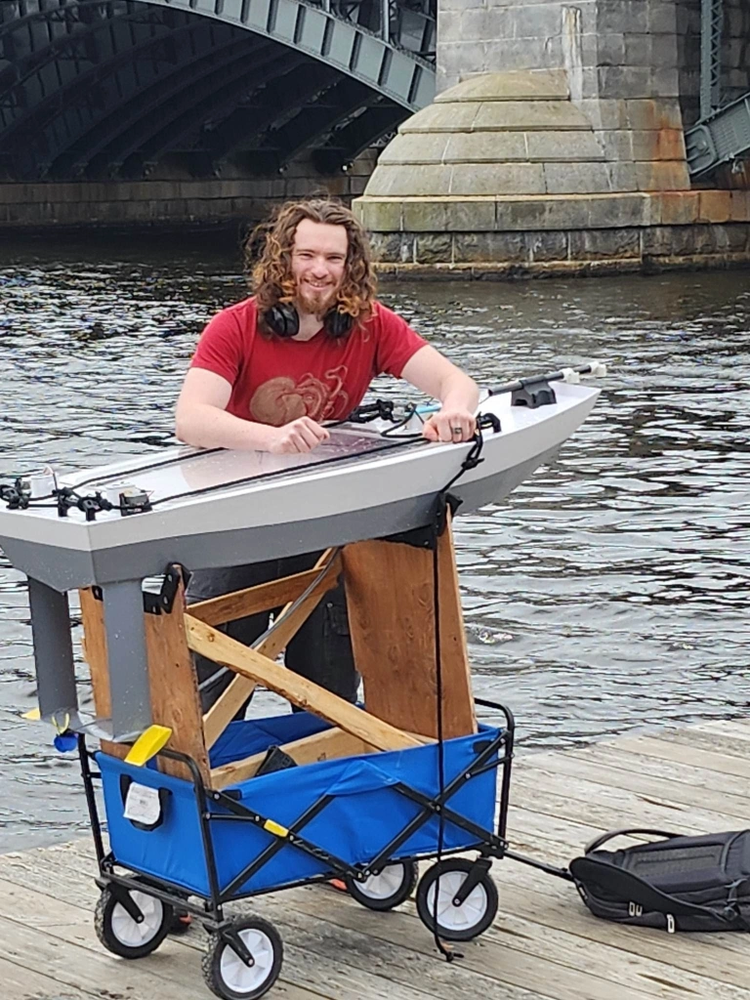
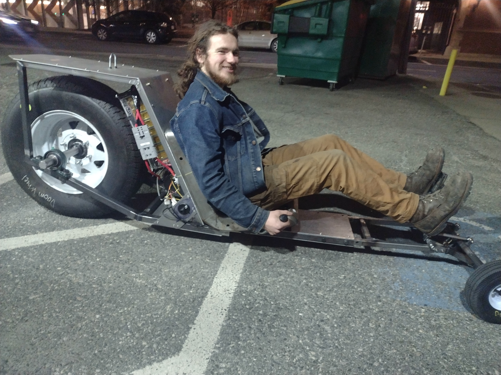

## About

I am a graduate of MIT in Mechanical Engineering at MIT, former west coast commercial fisherman, and current Formlabs test engineer. I've been building machines of all sorts for as long as I can remember and I'm especially interested in combining my interest in mechanical engineering and ocean technology.


---

---

### Student Groups/Clubs
- President at the MIT Electrical Research Society (MITERS) 2020-2023  [MITERS Website](http://miters.mit.edu/)
- Former President of the MIT Combat Robotics Club (CRC) 2020-2023
- Soft/Hard Hybrid Prosthetic Hand with Roche Laboratories at MIT 
”A Multi-Material, Anthropomorphic Metacarpophalangeal Joint With Abduction and Adduction Actuated by
Soft Artificial Muscles,” IEEE Robotics and Automation Letters, July 2022
- Characterizing Hydrofoils in the MIT Tow Tank with MIT Sea Grant
  [MIT Sea Grant](https://seagrant.mit.edu/)
---

### Areas of Interest
- Additive and Subtractive Manufacturing
- Marine Engineering
- Robotics
- Electric Vehicles
- Hydrofoils
- High Vacuum
---

### Employment
- Test Engineer at Formlabs (Current)
- Mechanical Engineer Intern at Indigo Tech (June - August 2021)
- Deckhand on Westpack (off and on, 2019-2020)

## Projects

  
  

    
High Vacuum System

    
I'm running an Alcatel rotary vane roughing pump and an Edwards turbo pump. The system is run through a raspberry pi that controls pumps and pneumatic valves that control the vacuum valves. The goal is to be able to remotely pump down the system and record sensory data on the pi. This is part of an ongoing project to build night vision goggle (NVG) tubes. NVG tubes are under vacuum and require a metal coating on glass photomultiplier discs. Currently the system is able to do physical vapor deposition (PVD). 

  

  
  

    
Vintage Moped Electric Conversion

    
I bought a Jawa Babetta moped off of Facebook with a shot engine and pedaled it back home. I rebuilt a gigantic drone motor I had spare so that the shaft was reversed to reduce cantilever. I welded and machined my own custom sprockets and built a 72 volt LiFePo battery that fits into an aluminum box I fabricated from several old MacBook cases. The controller is a high current VESC I slotted into a waterproof enclosure I fabricated from 3D printed parts and aluminum box tubing. I also redid the electronics to run a modern LED headlight (actually a car fog light), using buck converters to adapt down to 12 volts. I was able to keep the stock throttle by building a throttle adapter that allowed me to pull an analog throttle voltage from the original cable throttle It worked almost without maintenance for the entire Summer. 

    <a class="project-link" href="/projects/jawa/">Learn more about this project</a>
  

  
  

    
Robo Hydrofoil

    
My undergraduate thesis project at MIT. Unfortunately unfinished by the time I left MIT, but the hydrofoil was intended to be a remote control boat with actively controlled hydrofoils. The full details are available to read below. 

  

[Download Thesis PDF](poss-jonhenry-bachelorsofscience-mechanicalengineering-2023-thesis.pdf)

  
  

    
Doomsled MkII

    
It's a giant, electric ice luge? Front bogey steering controlled with foot pedals. It's an odd but surprisingly intuitive steering design that uses a homemade head tube mounted with enough angle to provide stability at speed and tilt into steering. I handled most of the welding and mechanical design, and my EE friend built the battery, got the controller working and built the steering. It's built mostly from parts we found in the workshop and we pulled it off in only a few weeks. Some things are definitely jury rigged, but the end result is quite fun regardless. 

    <a class="project-link" href="https://youtu.be/H-JZ_1kkQL0?si=4yw5LJ4ZahTRlYf8">See it run on youtube</a>
     -------
    <a class="project-link" href="https://evagorac.github.io/page/doomsled.html">Read Chris Evagoras writeup</a>
  

  
  

    
Electric Unicycle

    
PID controlled miniature self balancing unicycle. Strong enough to support a person despite its small size. Uses a hoverboard motor powered off of two Ryobi power tool batteries. Despite the symmetrical appearance, the motor is actually only supported on one side with a 1in aluminum skeleton internally to support the load path. 

    <a class="project-link" href="/projects/unicycle/">Learn more about this project</a>
  

  
  

    
Electric Mountainboard

    
This is a personal project I built in my garage during quarantine, partially with MIT Projx funding. The board utilizes a somewhat novel approach to skateboard steering and suspension designed with the poorly paved roads and walkways in and around MIT in mind. The steering, in particular, seems to be unique in this application. This was also an opportunity for me to learn lithium-ion battery building and fiberglass composite skills, as well as an opportunity to work with automobile-style linkages on a smaller scale. 

    <a class="project-link" href="/projects/boat/">Learn more about this project</a>
  

