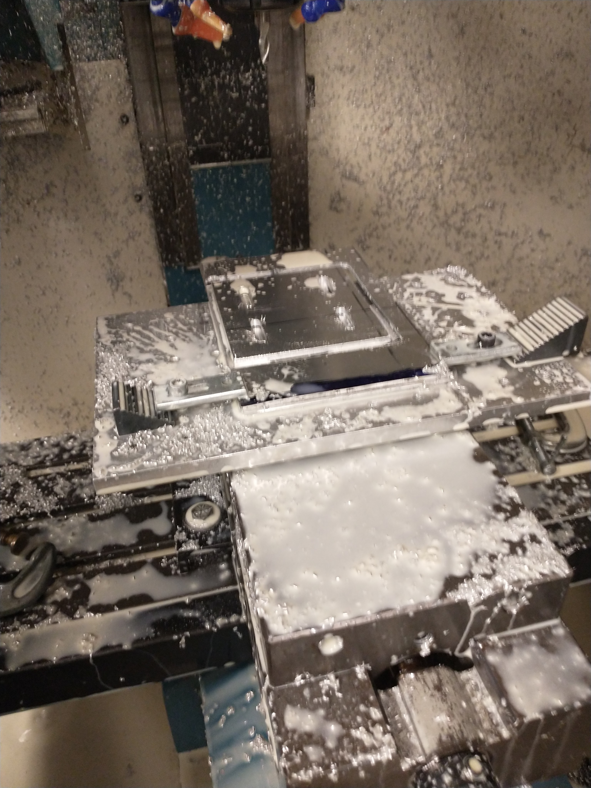
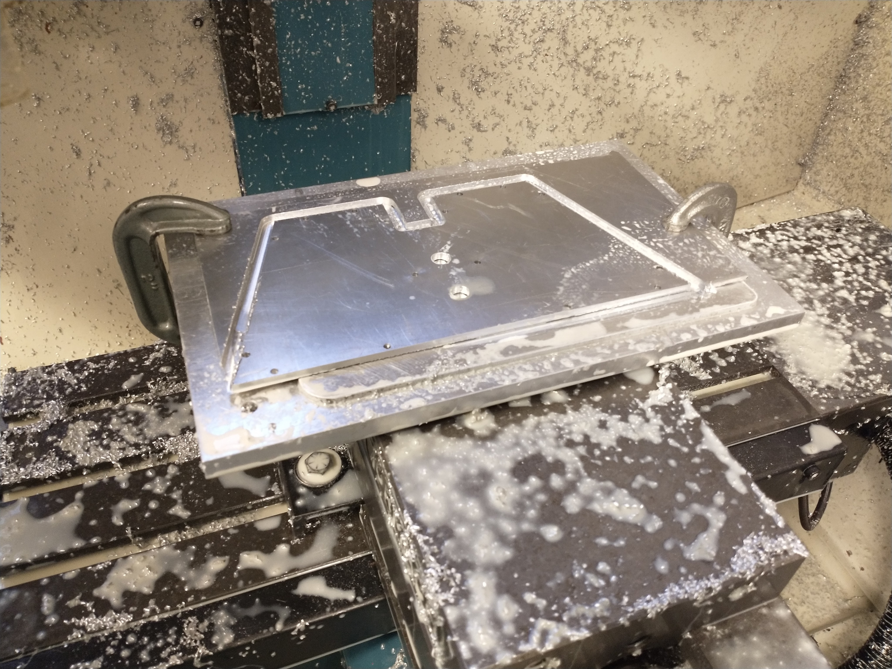
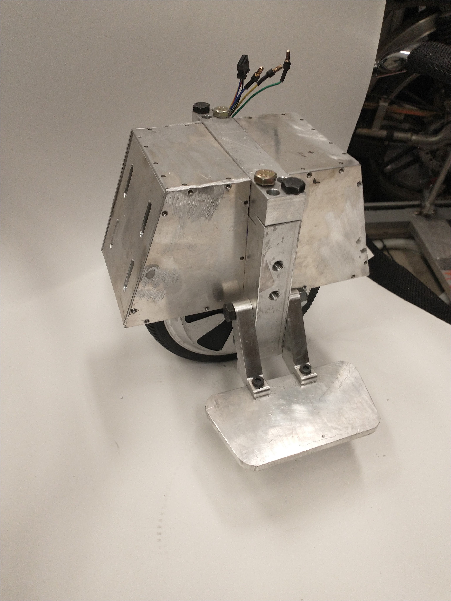
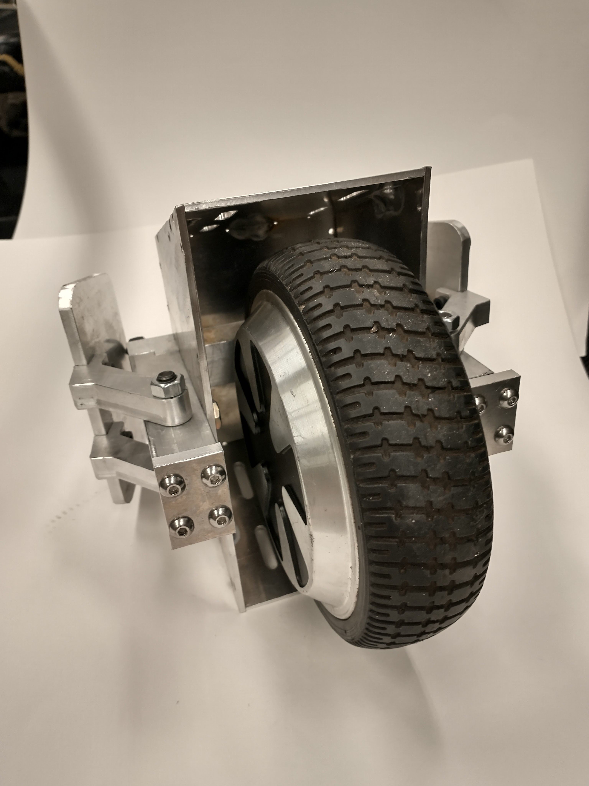
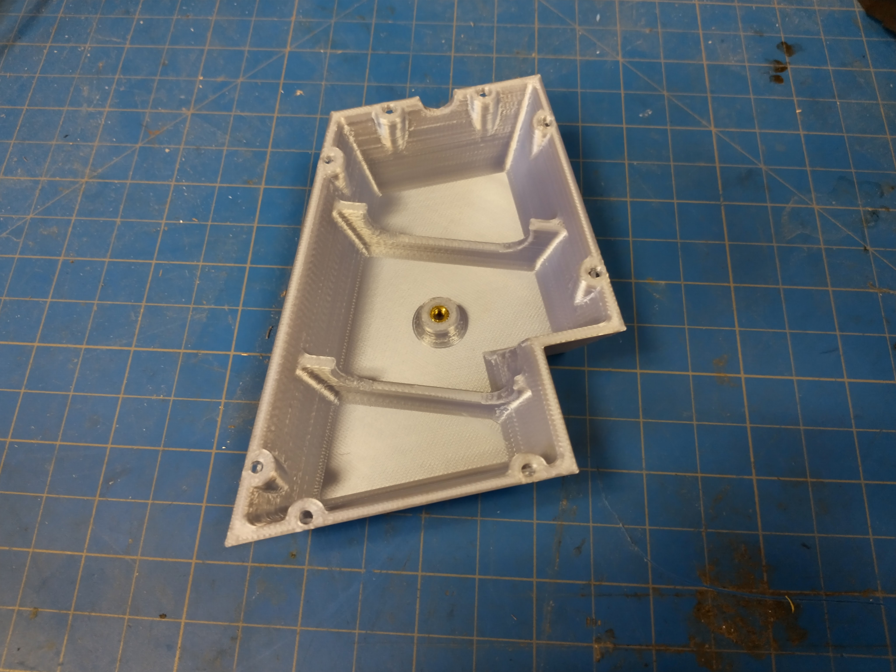
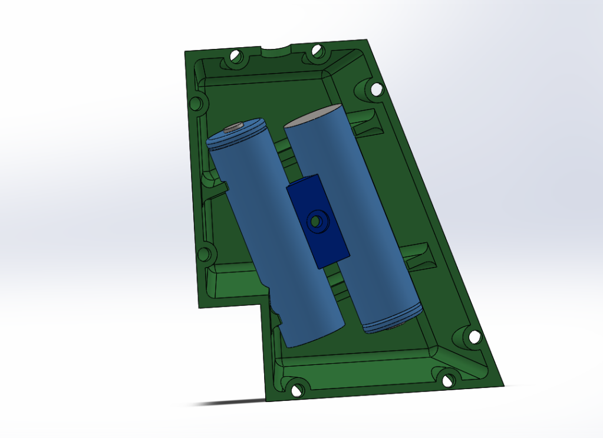
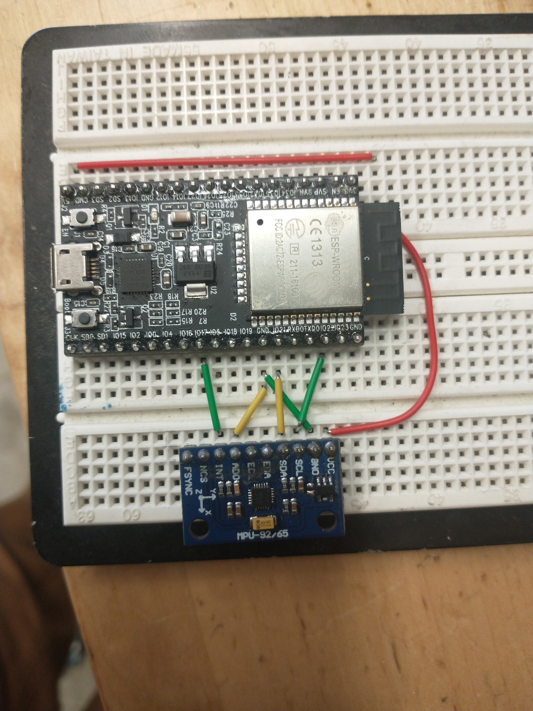
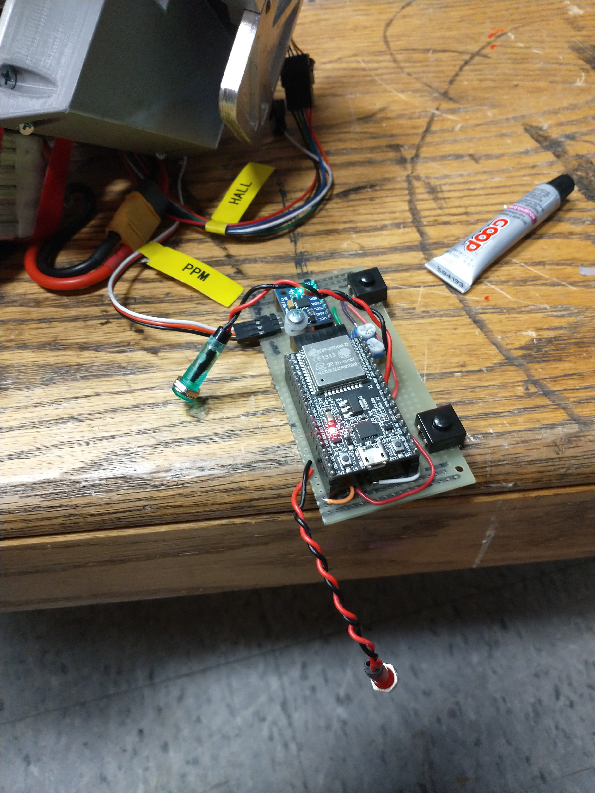

- [Indtroduction](#introduction)
- [Design](#design)
- [Machining](#machining)
- [3D Printing](#3d-printing)
- [Electronics](#electronics)
- [Tuning](#tuning)
- [Switching Gears: New Electronics](#switching-gears-new-electronics)
- [Ryobification](#ryobification)

## Introduction

I fell in love with electric unicycles after spontaneously buying a broken Segway Ninebot Z10 on craigslist and fixing it up. I have since blown up its motor controller. My hope is to get this small scale model balanced and working properly and to apply this to rebuilding the much larger Z10. Electric Unicycles (EUCs) are self balancing. When the rider leans forward, the controller attempts to correct the lean by accelerating. This conveniently allows the unicycle to be driven without a controller or throttle.



## Design
Nothing too fancy here. An aluminum skeleton surrounded by 1/8in aluminum cowling. The unicycle is build around an 8in hoverboard motor. The motor shaft is clamped with a sort of v-block.



## Machining
The motor I used for this build is off of a hoverboard. Its a hub motor - meaning the motor itself is fully integrated into the wheel. Hoverboards have wheels on either side, so the motor only has a shaft on one side. That's great for a hoverboard, but forces the unicycle to have a sort of asymmetrical, cantilevered frame. I also wanted foldable pedals, mostly because they're neat and all commercial unicycles have this feature. Ideally I'd like to come up with something to hold the pedals folded, like a magnet. But for now they just hang down.



I discovered a fixture plate sitting around MITERS, which made machining the 1/8in aluminum cowling pieces much easier. Would have been easier to waterjet, but I could use the practice on the CNC anyway.


 
 


I went ahead and tapped what felt like 100 M4 holes in cowling and bolted the side plates to the skeleton. Then I welded the cowling together from the inside. Worked alright, only a small amount of shifting and no obvious burn through. I kept the welds short to avoid filling in or distorting the newly threaded holes. This all functions mostly as a fender and a convenient place to mount the batteries and electronics. And style, style is important.


 
 


## 3D Printing 

It took an embarrassing number of attempts to print this in a way that the bolts would actually fit... somehow. Oh well.



The side cover plates integrate 18650 cells. A pain for wiring, but pretty stylish. Also uses brass inserts... fancy! Because I expected to be overeager with testing, I also machined in mounting points on the aluminum cowling for Lipo pouch batteries.


 
 


Now I didn't actually end up using any of this, but the idea was that I would be able to hide enough 18650s into the outer shell. This was scrapped for a few reasons, but we'll get to that...

## Electronics

Mounted up to the unicycle. Notice the lipo battery strapped to the cowling because, as I suspected, I could not be bothered to assemble the 18650 battery. The readings seem reasonable enough



The motor control is handled with a Vesc motor controller, which takes input from an ESP32 microcontroller for self balancing. I started with an MPU95 9axis inertial measurement unit (IMU) for angle measurement. Wired it up on a breadboard and everything worked. Soldered it all onto a proto-board and promptly blew up IMU. Fortunately, I found the faulty wire and a 6 axis MPU6050 dropped right into the same header. That worked fine.


 
 


## Tuning

The unicycle is balanced with a PID controller. Generally, it's acceptable to tune these types of controllers experimentally. However, I obviously haven't had much luck



## Switching Gears New Electronics
New VESC, new IMU, new batteries. Old batteries were lent out to a friend's skateboard and were promptly destroyed. New setup is 48v with four 3s LiPo packs in series. I took these apart, added balance leads, and heat shrinked them back together. I also printed out battery boxes and electronics box that bolt around the aluminum frame.



It works!




## Ryobification

Lithium ion batteries are perhaps not the safest technology. Fortunately, batteries with built in safety technology that have been properly evaluated (UL Certified) can be had from the local home depot... 

Ryobi batteries are cheap but still UL certified. With my new access to free formlabs printing, I built a new sls printed shell with built in ryobi battery holders. 

