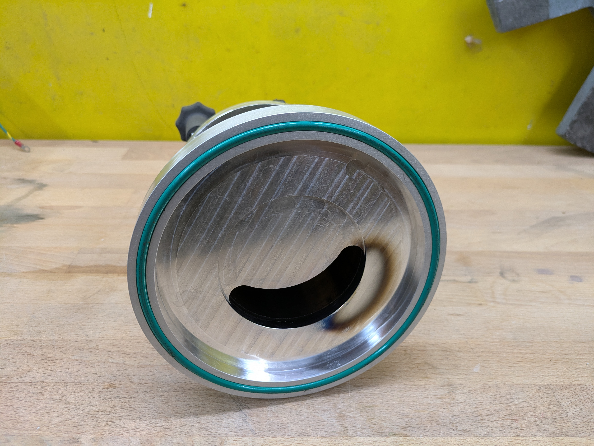

- [Introduction](#introduction)
- [Equipment Aquisition](#equipment-aquisition)
- [Plumbing](#plumbing)
- [Control Box](#control-box)
- [Physical Vapor Deposition](#physical-vapor-deposition)

## Introduction




###
I've always tended to collect pumps. I'm not entirely sure what motivates my interests in fluid moving devices, but having a large collection of pumps on hand has often been useful. Creating a high vacuum environment, that is down to somewhere around \\(1.31578947 × 10^{-8}\\) atmospheres, is something of the ultimate challenge in pumping. Down past \\(10^{-3}\\) torr or so, gas stops behaving like fluid and starts behaving like a bunch of particles bouncing around without ever touching each other and pumping has to get a bit more creative. There's also the issue of offgassign, where something like a fingerprint or a material with low vapor pressure like tin or most plastics evaporates enough to affect the vacuum.

<!--divider-->

###
That said, high vacuum is useful for a variety of experiments. Creating metallic coating through physical vapor deposition (more on that later), creating nonreactive environments for high voltage equipment, etc all require high vacuum. I already had a surprising collection of vacuum equipment on hand, so when my friend Chris suggested we do some high vacuum projects I said I had just the thing.




---
## Equipment Aquisition

---
### Turbo pumps

Turbo pumps are the most expensive part of this projects. I had four. Two from a spectroscopy machine I found in the trash, one I found in the ceiling, and another that was kicking around [MITERS.](https://miters.mit.edu/) I ended using one of the smaller Edwards turbo pumps off of the mass spectrometer because it had an integrated controller and I had the 80v DC power supply off of the same machine.



---
### Roughing Pump

Roughing pumps aren't nearly as expensive or hard to find as turbo pumps, but they aren't cheap either. Fortunately, I had one on hand abandoned in MITERS. I strapped it on my bike and took it home. My bike frame isn't really up to having a 60lbs weight on the back, but it got the job done


This pump worked, but it was a bit leaky and didn't have any sort of protections against pulling all the oil into the rest of the system if it lost power. Within a week, I got a text telling me there were two abandoned Edwards Rotary Vane pumps abandoned in a loading dock. All I had was my bicycle, so another 60+lbs pump went on the bike...
This was a much nicer pump but had an interesting sharpie inscription: "IS BORK PLZ FIX FREE"



The pump was showing it had no oil. Rotary vane pumps use oil to create the seal do their pumping, so without oil the pump couldn't possibly work. I filled it up with the oil from the old orange pump and hit the on switch.

It worked. Flawlessly

Apparently a $6000 oil rotary vane pump was thrown out because it was out of oil...

Oh well, my gain

---
### Everything Else

I got my sensors from MITERS and a lab cleanout at MIT NANO. That's a couple of pirani gauges and a cold cathode pressure gauge.

The rest came courtesy of ebay and whatever I had in my piles of plumbing.

---
## Plumbing


graph TD
    RP[Roughing Pump] --> OT[Oil Trap]
    OT --> VV[Vacuum Valve]
    PG[Pirani Gauge] --> VV[Vacuum Valve]
    VV --> TP[Turbomolecular Pump]
    TP --> VC[Vacuum Chamber]
    V[Vent] --> VC
    CG[Cold Cathode Gauge] --> VC



###
- Roughing Pump: Edwards Rotary Vane Pump brings the system down to around \\(10^{-3}\\) Torr
- Oil Trap: Prevents oil vapor from making it from the roughing pump into the rest of the chamber. Basically just a fancy holder for dessicant.
- Pirani Gauge: uses the thermal conductivity of gas to determine pressure. Only good down to rough vacuum.
- Vacuum Valve: pneumatically actuated valves with stainless steel belows for sealing. Allows the vacuum chamber to be isolated from the roughing pump. This way the turbo pump can be kept at vacuum to maintain cleanliness.
<!--divider-->

###
- Turbo Pump: takes the system down to (theoretically) around \\(10^{-7})\\ Torr, practicaly gets me down to around \\(5e-5\\) Torr. Must be run in vacuum.
- Vent: allows for slow venting of the chamber
- Cold Cathode Gauge: must be operated in vacuum, but good for measuring pressures down into high vacuum



  
  
  
  
  



---
## Control Box



The entire system is controllable remotely by a raspberry pi server. The pi is connected to a series of relays to allow me to switch various parts of the vacuum system


graph TB
    subgraph Control
        Root[Control Box]
    end

    subgraph Pumps
        TP(Turbo Pump)
        RP(Roughing Pump)
    end

    subgraph Valves
        V1(Vacuum Valve 1)
        V2(Vacuum Valve 2)
    end
    
    subgraph Air
        AC(Air Compressor)
        S1(Solenoid 1)
        S2(Solenoid 2)
    end

    Root --> TP
    Root --> RP
    Root --> AC
    Root --> S1
    Root --> S2
    
    S1 --> V1
    S2 --> V2
    
    AC --> S1
    AC --> S2



The relay board routes 24v from the control box to the solenoids valves, the miniature air compressor, and the 120v AC relay that controls the rotary vane pump. The turbopump is on an additional line and simply has a control signal switched on or off to tell the pump to spin up.



This is then controllable remotely through a GUI.



---
## Physical Vapor Deposition


### Intro to PVD    


###
Physical vapor deposition (pvd) is the process of evaporating materials with a heating element to produce a vapor that can be deposited on a surface to create a thin coating. One recognizable use of this is first surface mirrors, which are glass sheets that have a layer of aluminum deposited on he surface. Of course, if you just got and vaporize aluminum in atmosphere you'll just get some aluminum oxide soot floating around in the air. The key is the nonreactive atmosphere under vacuum and something called mean free path.

<!--divider-->

### 
 This is the average distanace a particle can travel without coming into contact with another particle and changing direction. In air, this is very short. If you vaporize aluminum, the aluminum particles will immediately contact the particles of gas that make up the air. In vacuum, this is not the case and the aluminum vapor can travel several inches before eventually contacting the walls of the chamber or the target. If the target is a compatible and properly prepared substate, the aluminum with attach to the surface and create an nearly perfect surface. This makes PVD a line of sight operation, only objects "visible" from the point of origin of the vapor will actually be coated. The aluminum won't change direction or coat around corners. 


---
### Chamber

### 
Most rubber won't hold up to high vacuum without offgassing. One exception is viton. The green orings you see are made of this material. The chamber connects to the flat plate on which the vacuum is mounted with a sealing oring. Then a heavy wall borosilicate glass tube is sandwitched between two machined aluminum plates and bolted in place with plastic screws for electrical isolation. 

<!--divider-->

### 
The top aluminum plate I machined at MITERS on a manual mill on a rotary table. The lower plate was made in China through JLCPCB. I'm very happy with the outsourced machining, it was remarkably affordable and the results are good. 



  
  
  
  



---
### HIGH CURRENT
Power is supplied to the pvd chamber by a rewound microwave transformer. This takes the ~120V ac coming in from the wall and steps it down to only a few volts at very high current. A variac controls the voltage coming in to the microwave transformer. 


  


This then supplies the tungsten filament that vaporizes the aluminum. Copper bolts insulated with teflon and clamped against orings penetrate the aluminum plate. A third connection is also available if I ever want to use the plate itself as a conductor and bolt on a second filament for dual coatings. The cylinder in the middle of the aluminum plate is a rotary feedthrough, which I may use for a baffle or for rotating the target for a more even coating.

  
  


---
### Results

Seems to work 


  
