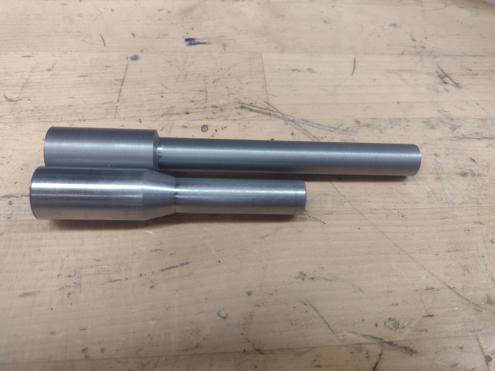
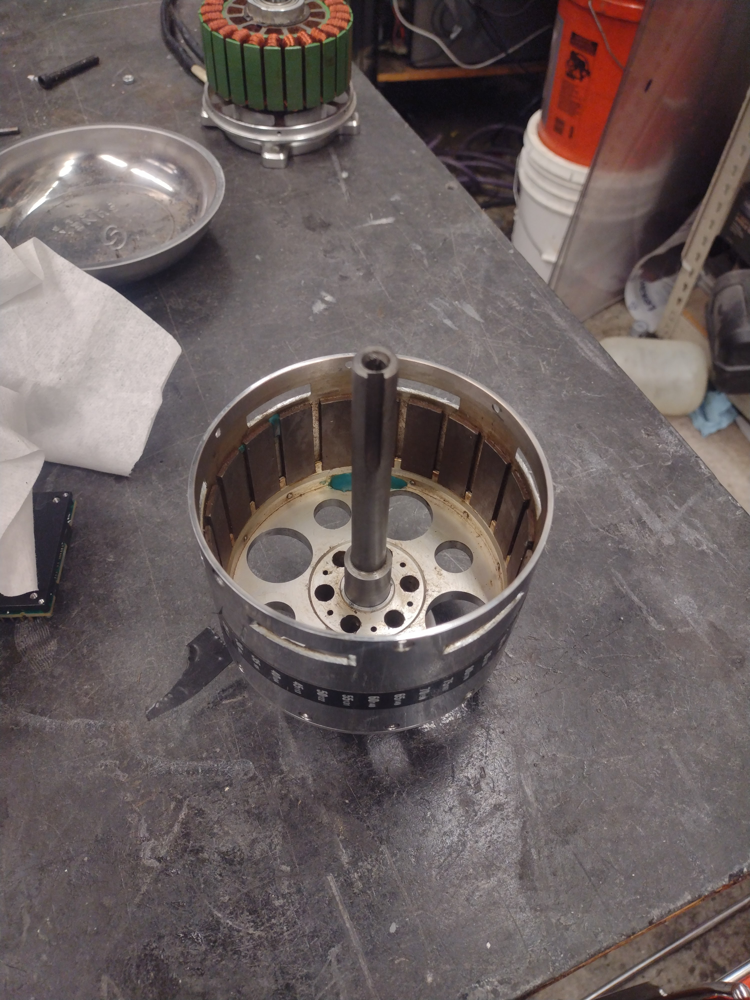

---

## Introduction
In a fit of boredom while writing my thesis, I bought a moped. Specifically, a broken Jawa Babetta 210. Rather than trying to fix a broken 1978 engine that's notoriously bad to begin with, I set out to do an electric conversion.



---
## Design

Most of the mechanical components are still just cleaned up stock parts, only the drive system is modified. I just dropped in a motor bracket where the engine once was, attached the motor controller under the front of the frame, and attached a battery box holder where the fairings normally attach.



---
## Motor Mod
The original motor was a heavy lift drone motor MITERS pulled out of a lake at one point. This was a great choice because, unlike most motors, it was free. Unfortunately, these types of motors aren’t really intended for the kind of lateral forces caused by the chain.



Rather than attaching the sprocket to the far end of the motor as the motor was intended, and cantilevering the whole stack, I turned a replacement , longer shaft and pressed this in in place of the original;. This allowed me to attach a sprocket to the base instead.


 
 


---
## Front Sprocket 
Jawa 210 mopeds use a unique chain that has a 0.5in pitch, but unusually large rollers. The chain is not compatible with 415 sprockets, but 415 chain is more or less compatible with Jawa sprockets. I kept the original rear sprocket but replaced the chain and front sprocket with a 415 standard.



I've cut internal keyways before and it's just not an enjoyable process. When I can, I buy "weld-on keyed hubs", which are bored cylinders with pre-cut keyways and set screws that I just weld to a flat sprocket. In this case, I just bought the sprocket, but less common sizes can be cut on a mill or waterjet and then ground to a taper. 



---
## Battery 
Nothings too crazy here. Just a 20 series, 3 parallel set of LiFePo3 cells. Should do 150 amps continuously.




---
## Battery Box
Originally, I welded up a steel box and mounted it to the frame. The idea was that I would be able to remove the discrete batteries from the top. However, the seat gets in the way.



I whipped out my trusty angle grinder and hacked down the box. Then I fabbed an aluminum box from welded together MacBook cases. For the finishing touch, I added some canvas straps to hold everything together. Looks stylish, needs some decals.




---
## In Action


