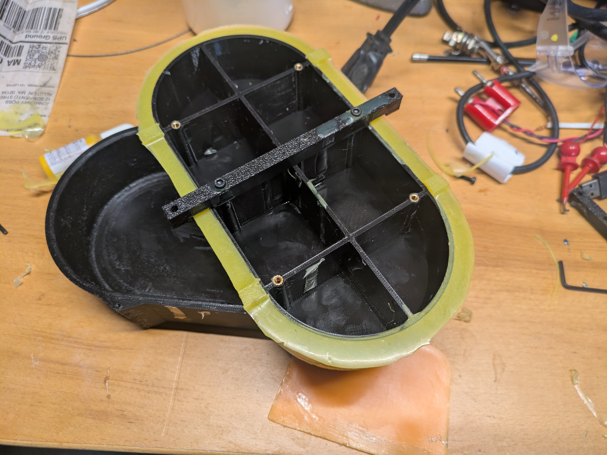
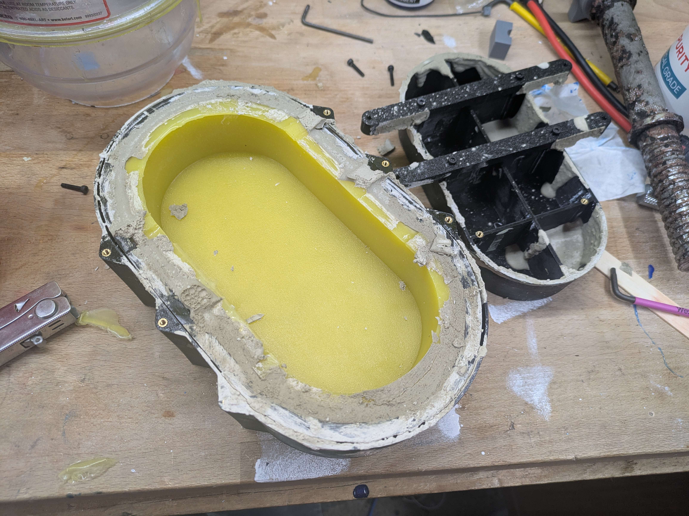
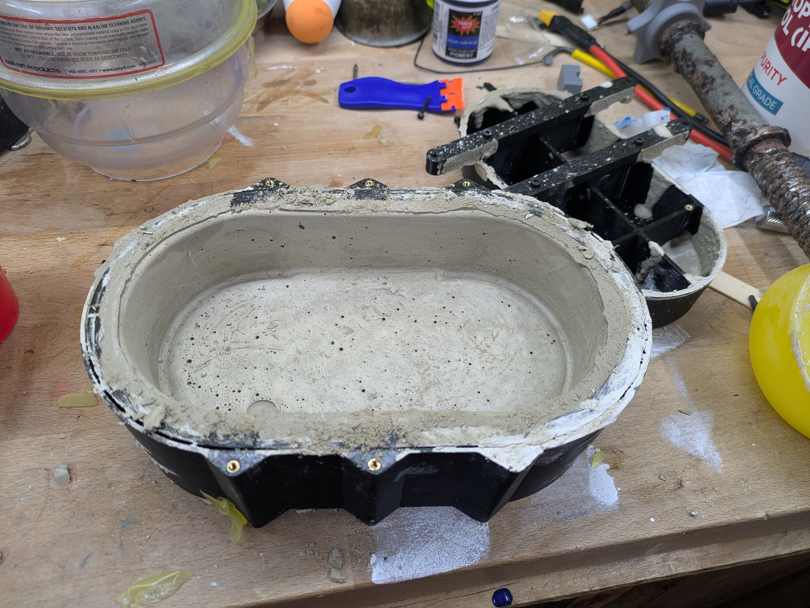
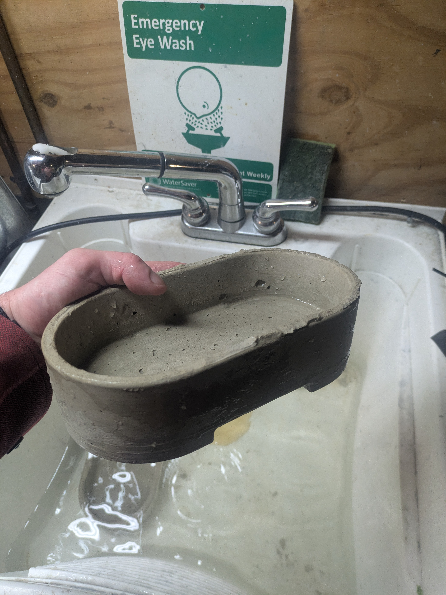
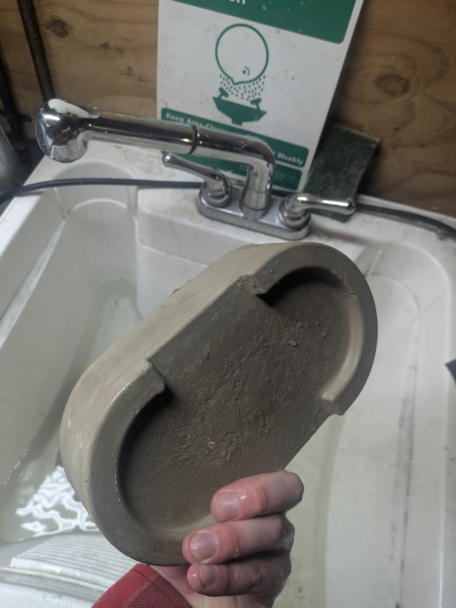
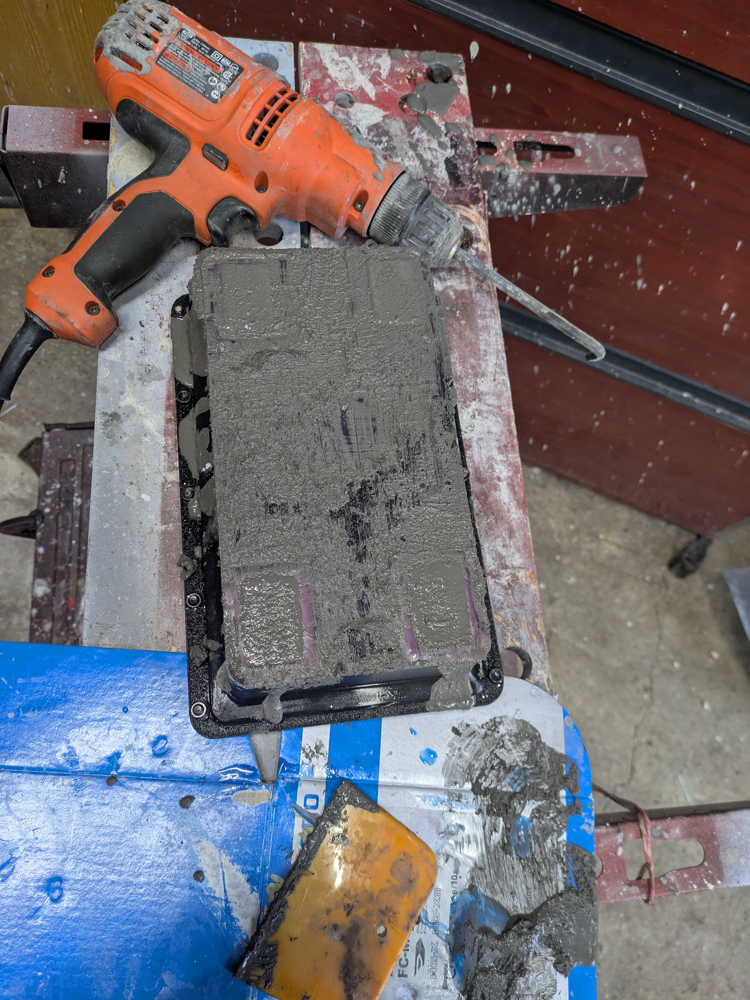
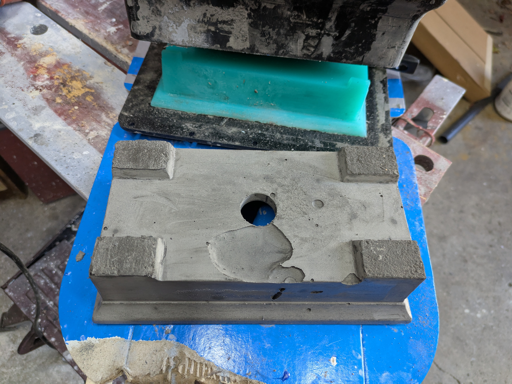
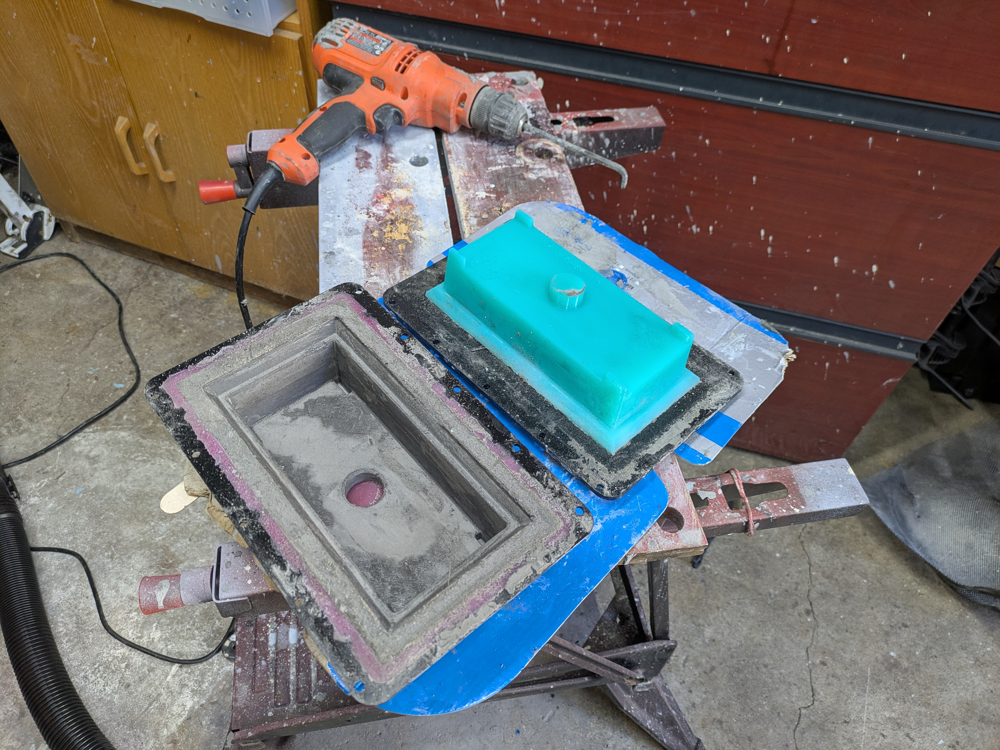
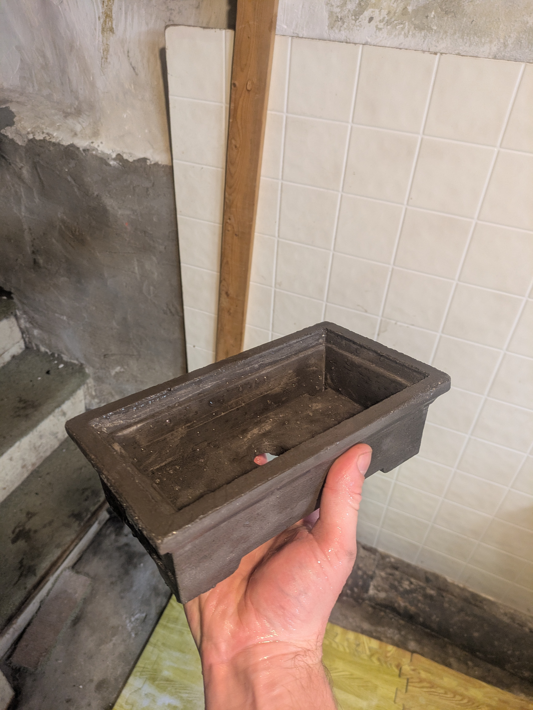

## Explanation

Bonsai pots are slightly expensive. So rather than buying them I spent two weeks designing molds, burning through my silicone reserves, and teaching myself how to cast concrete.

## First Attempt

This is a more traditionally shaped, round bonsai pot. Generally speaking, hard materials should be cast into soft molds and vice versa. So I printed a mold mold, cast a silicone mold, then cast concrete into the mold. Urethane is the prefered material for concrete molds because it's tough enough to be resistant to abrasive concrete and self lubricating enough to release well. I had some spare urethane I used for the outer mold and some expired bucket fulls of silicone I used for the insert. 

This was just straight concrete vibrated into place with poorly balanced corded drill. I removed the concrete about an hour after pouring and finished curing underwater 


  
  
  
  
  


## Second Attempt
I had a much harder time with this one.  

  
  
  
  
