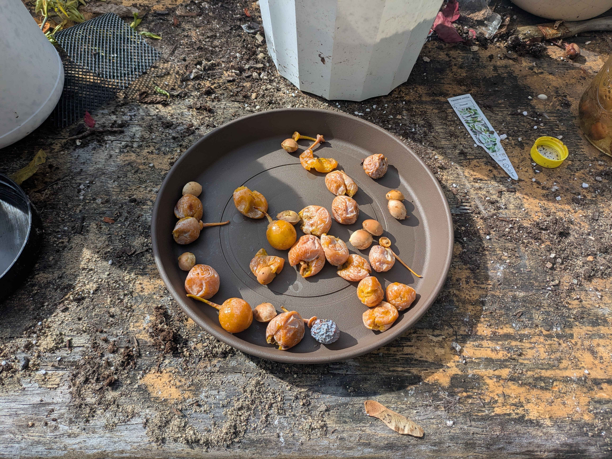
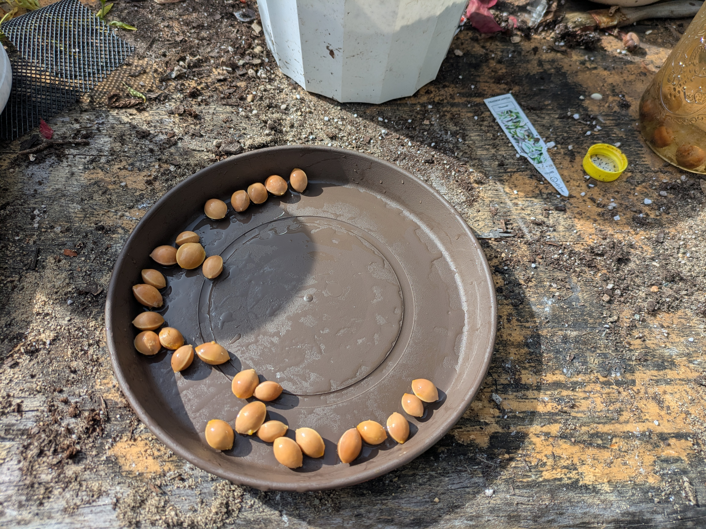
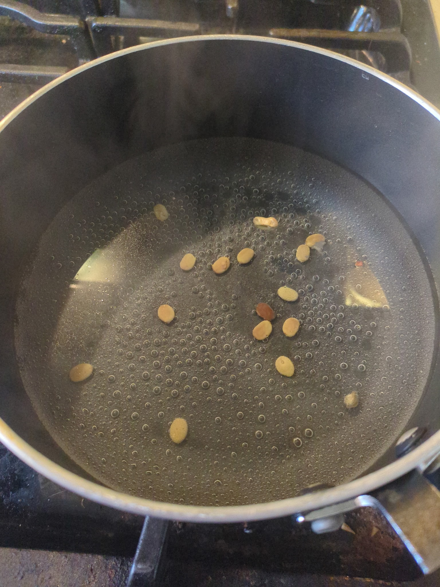
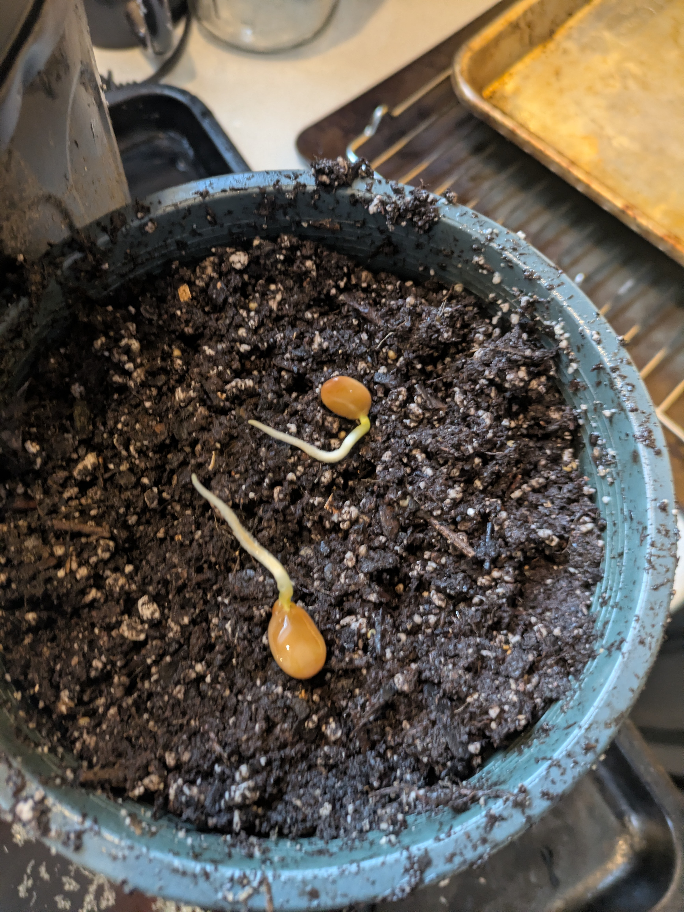
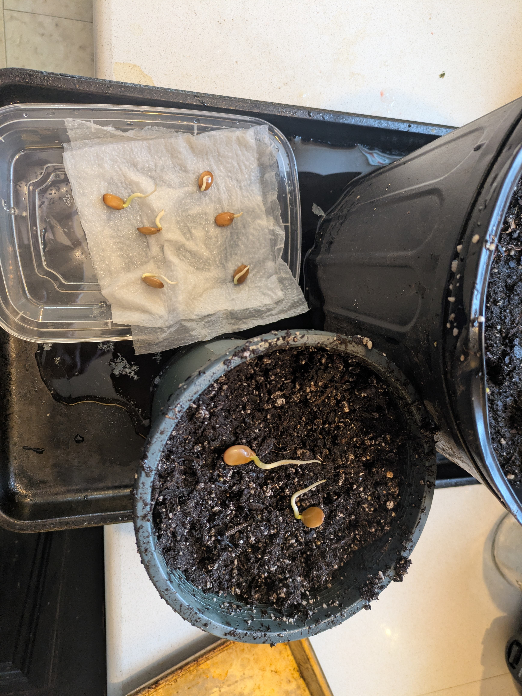

## Explanation

Been really into plants this winter. The problem, of course, is that you can't really grow much in Boston during the winter. Rather than growing things, I'm exploring seed collection and hardwood propagation.

It's been interesting discovering how Boston trees have developed cold weather adaptations. Coming from California, I'm no stranger to tree seeds having a particular set of criteria that must be met before germination occurs. In California, this is generally fire. In New England, it's cold stratification.

## Ginkgo

Ginkgo trees are one of my favorites. There are quite a few ginkgo trees in Boston, the problem is they're almost all males. Ginkgo tree fruit smell like rotting butter, so municipalities tend to avoid planting female trees. I dug through iNaturalist and found two pictures of ginkgo fruit. One near Emily street near Central and a second in Arsenal Yards. I was only able to find the one in Arsenal Yards, which sure seemed to be a single female tree that was missed during planting. I filled my backpack with foul-smelling fruit and called it a success

Ginkgos do need cold stratification, so I removed the fruit and have the seeds in the vegetable crisper in a bag of damp peat moss. We'll see how it goes.


  
  


## Honey Locust

Honey locust don't require a cold stratification process, but they do need scarification to start to take up water and germinate. I did this by bringing water to boil, removing from heat, and tossing in the seeds free from the seed pod. I soaked the seeds until the water dropped to room temperature and left them in a windowsill in a bag with damp paper towels. 

  
  
  
