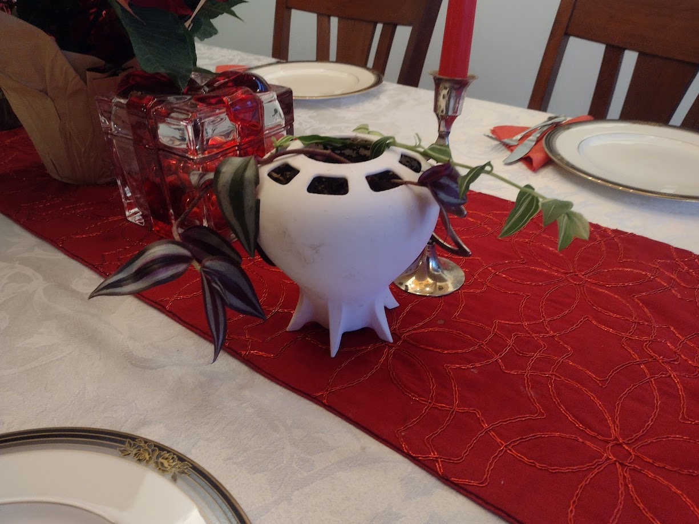
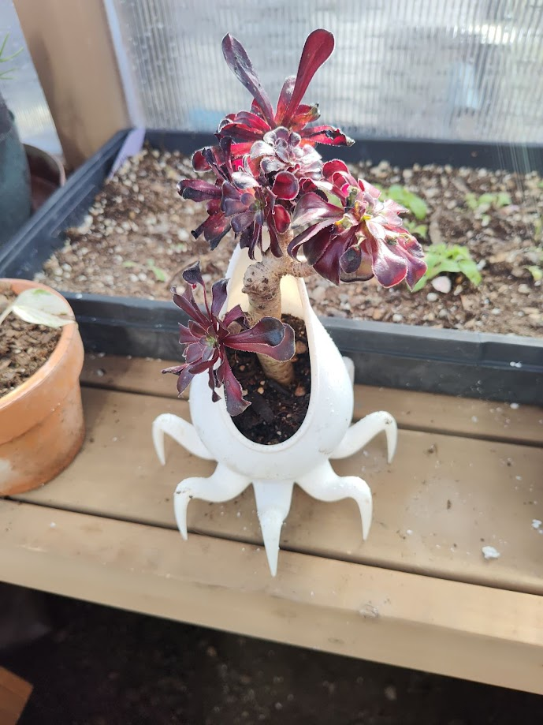
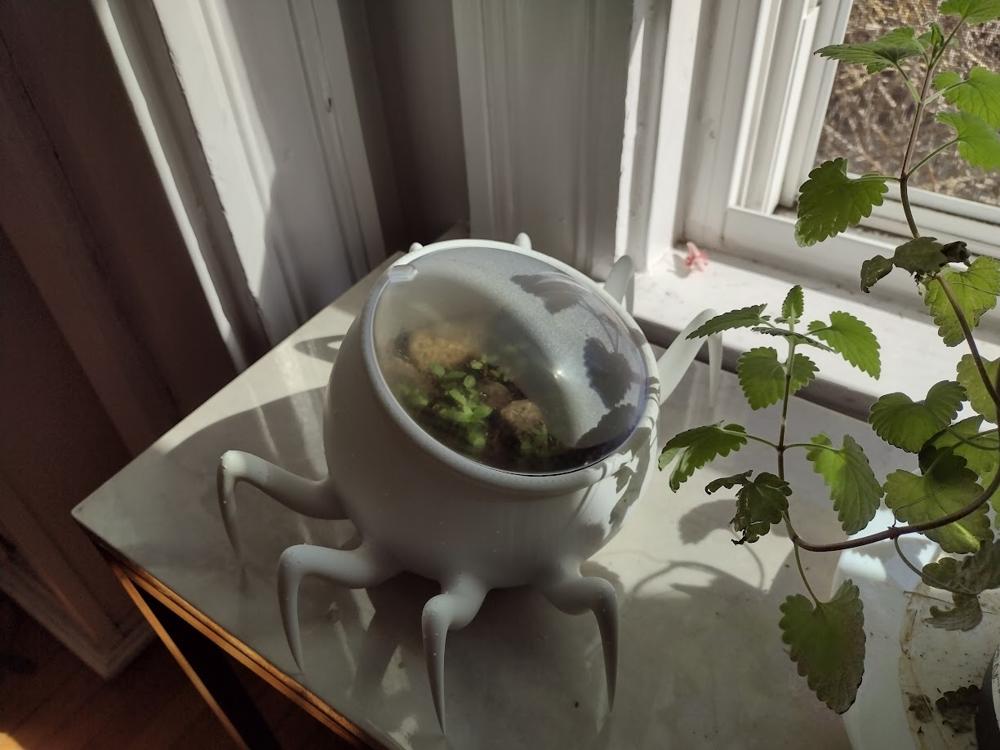
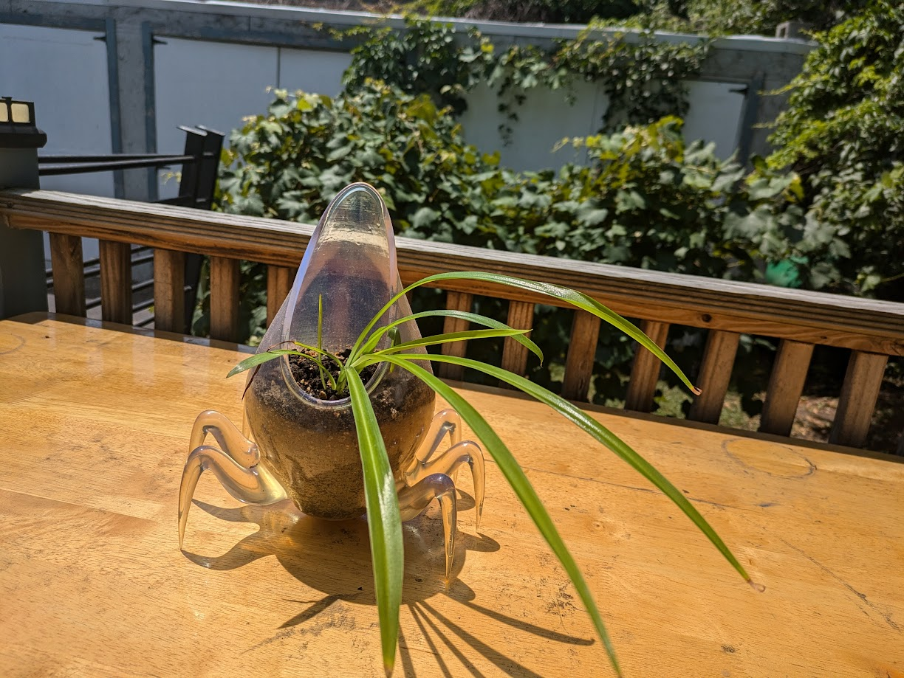
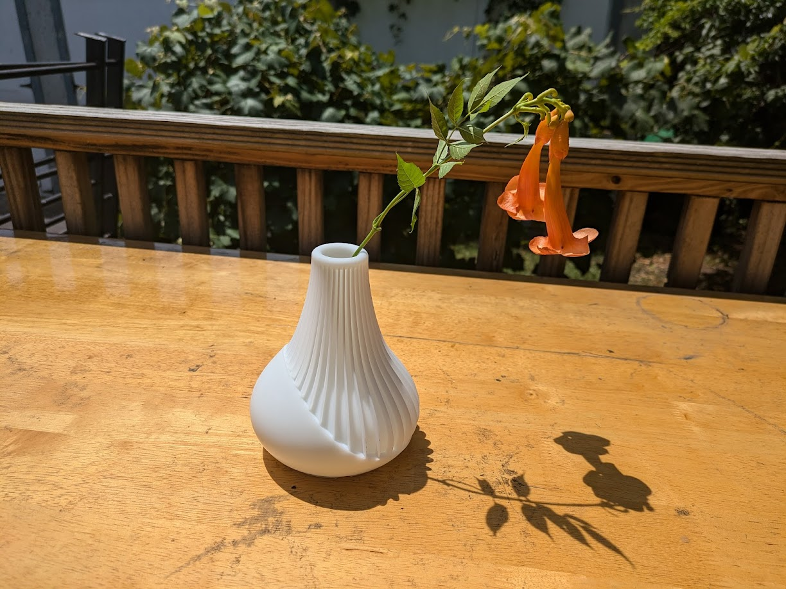
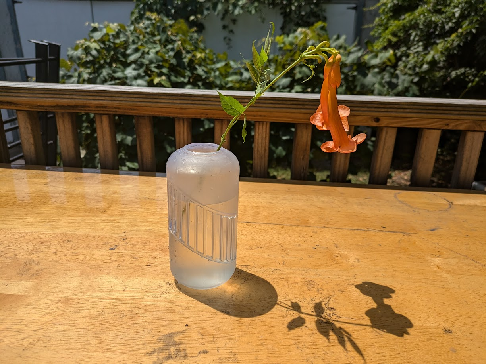
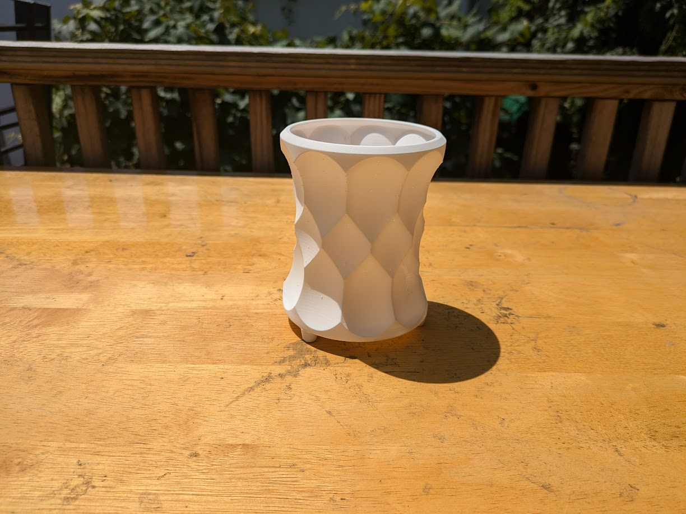

## Explanation

I like plants. Also, these were a good way to push myself making organic shapes in parametric CAD. All models were designed in Onshape and printed on Formlabs printers


 
 
 
 
 
 
 
